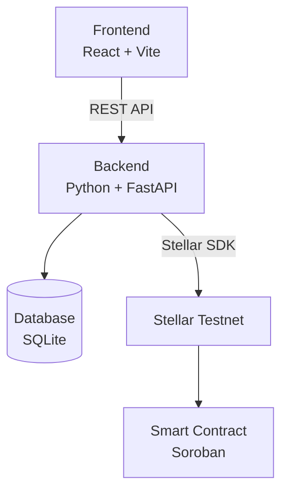
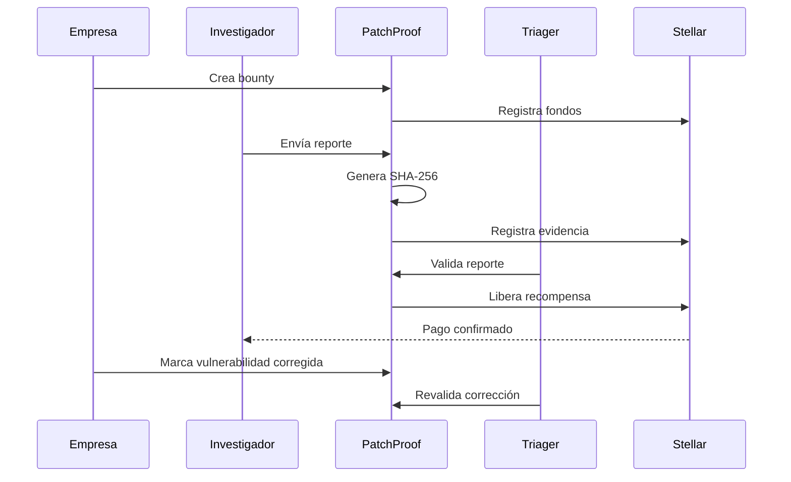

# PatchProof 🔐

**Verifiable bug bounty lifecycle powered by Stellar**

PatchProof es una plataforma para gestionar programas de **bug bounty** mediante un proceso verificable de reporte, validación, pago y remediación de vulnerabilidades.

El proyecto busca reducir uno de los principales problemas entre empresas e investigadores de seguridad: **la confianza**.

Una empresa necesita recibir reportes de forma segura y demostrar que fueron atendidos.  
Un investigador necesita tener certeza de que su hallazgo fue registrado y que la recompensa prometida realmente existe.

PatchProof utiliza **Stellar** como una capa de verificación para registrar evidencia, gestionar recompensas y mantener trazabilidad sobre el ciclo de vida de una vulnerabilidad sin publicar información sensible en blockchain.

---

## 🧩 El problema

En un programa de bug bounty intervienen dos partes que no necesariamente confían entre sí.

### Para el investigador

¿Cómo puede demostrar que reportó una vulnerabilidad antes de que la empresa la corrigiera?

¿Cómo sabe que la empresa realmente dispone de los fondos prometidos para pagar la recompensa?

### Para la empresa

¿Cómo puede demostrar que recibió, evaluó y atendió un reporte sin publicar información confidencial sobre sus sistemas?

PatchProof busca crear evidencia verificable de estos eventos sin almacenar exploits, credenciales ni detalles sensibles en una blockchain pública.

---

## 💡 La propuesta

El flujo principal de PatchProof es:

```text
Bounty creado
      ↓
Fondos comprometidos
      ↓
Reporte enviado
      ↓
Hash registrado
      ↓
Reporte validado
      ↓
Recompensa liberada
      ↓
Vulnerabilidad corregida
      ↓
Corrección revalidada
```

A este proceso lo llamamos:

### Verifiable Vulnerability Lifecycle

La blockchain no reemplaza el proceso de triage ni decide automáticamente si una vulnerabilidad es válida.

Su función es servir como una **capa verificable de confianza** para registrar eventos importantes del proceso.

---

## 🔐 ¿Qué se registra en blockchain?

PatchProof **no almacena vulnerabilidades completas en Stellar**.

El reporte permanece fuera de la blockchain y se genera una representación criptográfica del contenido.

```text
Reporte confidencial
        ↓
      SHA-256
        ↓
Hash del reporte
        ↓
Registro verificable
      en Stellar
```

Esto permite demostrar que una versión específica del reporte existía en determinado momento sin hacer público su contenido.

También utilizamos Stellar para:

- comprobar que existen fondos asociados al bounty;
- registrar evidencia del envío de un reporte;
- gestionar estados verificables;
- liberar recompensas;
- registrar la remediación y revalidación del hallazgo.

---

## 👥 Actores del sistema

### 🏢 Empresa

Puede crear programas de bug bounty y definir:

- alcance del programa;
- sistemas permitidos;
- recompensas;
- severidades;
- reglas;
- fondos disponibles.

---

### 🧑‍💻 Investigador

Puede consultar bounties disponibles y enviar reportes con:

- título;
- descripción;
- severidad;
- evidencia;
- pasos para reproducir el problema.

Después del envío, PatchProof genera una huella criptográfica del reporte.

---

### 🛡️ Triager

Revisa los reportes enviados y determina si el hallazgo es válido.

Puede marcar un reporte como:

- `VALIDATED`
- `REJECTED`
- `NEEDS_INFO`

En el MVP asumimos que el triager es una entidad confiable.

---

## 🔄 Estados de un reporte

```text
SUBMITTED
    ↓
VALIDATED
    ↓
PAID
    ↓
REMEDIATED
    ↓
VERIFIED
```

También puede existir el estado:

```text
REJECTED
```

si el reporte no cumple las condiciones del bounty.

---

## ⚙️ Arquitectura



El frontend se comunica con una API desarrollada en FastAPI.

El backend se encarga de:

- lógica de negocio;
- creación de bounties;
- gestión de reportes;
- generación de hashes;
- estados;
- almacenamiento;
- comunicación con Stellar.

---

## 🛠️ Stack

### Frontend

- React
- Vite
- JavaScript
- CSS

### Backend

- Python
- FastAPI
- SHA-256

### Blockchain

- Stellar
- Stellar Testnet
- Stellar SDK
- Soroban

### Smart Contracts

- Rust

### Datos

- SQLite

### Desarrollo

- Git
- GitHub

---

## 🚀 MVP

El objetivo del hackathon es tener un flujo completo y funcional.

La demo debe permitir:

1. Crear un bounty.
2. Asociar una recompensa.
3. Mostrar que existen fondos disponibles.
4. Consultar el bounty como investigador.
5. Enviar un reporte ficticio.
6. Generar el hash del reporte.
7. Registrar la evidencia.
8. Validar el hallazgo desde el perfil de triager.
9. Liberar la recompensa mediante Stellar Testnet.
10. Mostrar la transacción.
11. Actualizar el estado del reporte.
12. Marcar posteriormente la vulnerabilidad como remediada y verificada.

---

## 🎬 Flujo de la demo



---

## 🧪 Ejemplo de demo

Para evitar utilizar información real o sensible durante el hackathon, trabajaremos únicamente con vulnerabilidades ficticias.

```text
Title:
Authentication bypass demo

Severity:
HIGH

Reward:
500 TEST-XLM

Status:
SUBMITTED
```

Después de enviar el reporte:

```text
Evidence registered ✓

Report Hash:
8F4C...92AB

Status:
SUBMITTED
```

Una vez validado:

```text
Report validated ✓

Reward:
500 TEST-XLM

Status:
PAID
```

---

## 🔒 Seguridad y privacidad

PatchProof está diseñado bajo una regla principal:

> La blockchain demuestra que existe evidencia, pero no necesita conocer el contenido de la vulnerabilidad.

Por esta razón, nunca deberían almacenarse públicamente:

- exploits;
- payloads;
- credenciales;
- tokens;
- pruebas de concepto sensibles;
- instrucciones para atacar un sistema;
- detalles completos de vulnerabilidades reales.

La información sensible permanece **off-chain**.

---

## 🧱 Alcance del hackathon

PatchProof se desarrolla como un **MVP**, no como una plataforma empresarial completa.

Durante GOYA HACK priorizamos:

1. funcionamiento;
2. estabilidad de la demo;
3. integración con Stellar;
4. arquitectura clara;
5. experiencia de usuario.

Funciones como las siguientes quedan fuera del MVP:

- KYC;
- chat entre empresa e investigador;
- pagos con dinero real;
- soporte multiblockchain;
- reputación avanzada;
- arbitraje complejo;
- aplicación móvil;
- clasificación automática de vulnerabilidades con IA;
- infraestructura de producción.

Estas funciones pueden incorporarse posteriormente.

---

## 👨‍💻 Organización del equipo

El desarrollo se divide en cuatro áreas principales.

### Backend

- FastAPI
- API REST
- lógica de bounties
- reportes
- generación SHA-256
- estados
- conexión con base de datos

### Frontend

- React + Vite
- dashboard de empresa
- vista del investigador
- vista del triager
- formularios
- visualización de hashes
- estados y transacciones

### Blockchain

- Stellar Testnet
- wallets de prueba
- Stellar SDK
- transacciones
- registro de commitments
- recompensas
- Soroban

### Integración

- base de datos
- pruebas
- integración entre módulos
- documentación
- despliegue
- preparación de demo

---

## 🏆 GOYA HACK 2026

Proyecto desarrollado durante **GOYA HACK · Hackathon UNAM 2026**.

**Track:** Innovación  
**Equipo:** 4 integrantes  
**Deadline:** 25 de septiembre de 2026

La evaluación considera:

- implementación técnica;
- innovación y creatividad;
- impacto y usabilidad;
- demo funcional y pitch.

---

## 📌 Estado del proyecto

🚧 **En desarrollo**

Actualmente estamos trabajando en el MVP y en la integración entre:

```text
React
  ↓
FastAPI
  ↓
Stellar Testnet
```

---

## 📄 Licencia

La licencia del proyecto se definirá antes de la entrega final.
