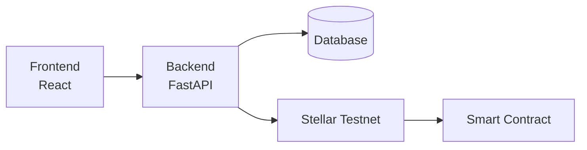

# PatchProof 🔐

**A verifiable bug bounty platform powered by Stellar**

PatchProof es una plataforma para gestionar programas de **bug bounty** de forma más transparente entre empresas e investigadores de seguridad.

La idea parte de un problema de confianza: un investigador necesita tener evidencia de que su reporte fue recibido y que la recompensa prometida existe, mientras que una empresa necesita gestionar estos reportes sin exponer información sensible sobre sus sistemas.

PatchProof utiliza **Stellar** como una capa de verificación para registrar eventos importantes del proceso, como el envío de un reporte, su validación y el pago de una recompensa.

La vulnerabilidad completa nunca se publica en blockchain. En su lugar, se genera una huella criptográfica del reporte que permite comprobar su existencia sin revelar su contenido.

---

## 💡 ¿Cómo funciona?

```text
Empresa crea un bounty
        ↓
Investigador envía un reporte
        ↓
PatchProof genera evidencia verificable
        ↓
El reporte es validado
        ↓
Se libera la recompensa
        ↓
La vulnerabilidad puede marcarse como corregida
```

El objetivo es crear un historial verificable del ciclo de vida de una vulnerabilidad sin depender únicamente de la confianza entre ambas partes.

---

## ⚙️ Tecnologías

El proyecto está siendo desarrollado con:

- **React + Vite** para la interfaz.
- **Python + FastAPI** para el backend.
- **Stellar Testnet** para las operaciones blockchain.
- **Stellar SDK** para la integración con la red.
- **Soroban** para smart contracts.
- **SQLite** para el almacenamiento del MVP.
- **GitHub** para colaboración y control de versiones.

---

## 🧩 Arquitectura general



---

## 🚀 MVP

Para el hackathon buscamos demostrar un flujo funcional donde:

1. una empresa publica un bounty;
2. un investigador envía un reporte;
3. PatchProof genera y registra evidencia del reporte;
4. el reporte es validado;
5. la recompensa se libera mediante Stellar Testnet;
6. el estado del proceso puede consultarse desde la plataforma.

---

## 🏆 GOYA HACK 2026

Proyecto desarrollado para **GOYA HACK · Hackathon UNAM 2026**.

**Track:** Innovación  
**Equipo:** 4 integrantes  
**Estado:** 🚧 En desarrollo

Las instrucciones de instalación, ejecución y enlaces de la demo se agregarán conforme avance el proyecto.
