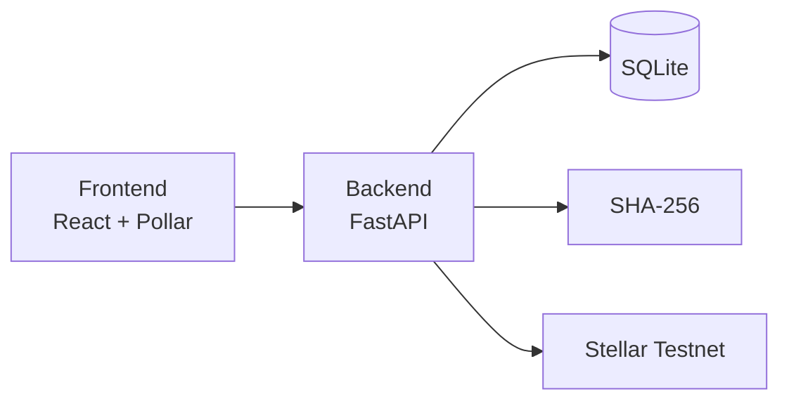

# PatchProof 🔐

**A verifiable bug bounty platform powered by Stellar**

PatchProof es una plataforma para gestionar programas de **bug bounty** de forma más transparente entre empresas e investigadores de seguridad.

La propuesta parte de un problema de confianza: un investigador necesita evidencia de que su reporte fue recibido y seguimiento sobre la recompensa prometida, mientras que una empresa necesita gestionar vulnerabilidades sin publicar información sensible sobre sus sistemas.

PatchProof utiliza **Stellar Testnet** como capa de trazabilidad para registrar evidencia verificable del proceso y realizar pagos de prueba. La vulnerabilidad completa permanece fuera de blockchain; en su lugar, se genera una huella criptográfica SHA-256 que permite comprobar la existencia del reporte sin exponer su contenido.

---

## 💡 ¿Cómo funciona?

```text
Investigador envía un reporte
        ↓
Se genera una huella SHA-256
        ↓
Se registra evidencia en Stellar Testnet
        ↓
SUBMITTED
        ↓
Triager valida el reporte
        ↓
VALIDATED
        ↓
Se procesa la recompensa
        ↓
PAID
        ↓
La empresa marca la vulnerabilidad como corregida
        ↓
REMEDIATED
        ↓
El triager confirma la corrección
        ↓
VERIFIED
```

Los estados y la información del reporte se almacenan en la base de datos, mientras que Stellar se utiliza para registrar evidencia y realizar las operaciones blockchain del MVP.

---

## ⚙️ Tecnologías

- **React + Vite** — interfaz web.
- **Pollar** — conexión y autenticación de wallet.
- **Python + FastAPI** — backend y API REST.
- **SQLite + SQLAlchemy** — persistencia de datos.
- **SHA-256** — generación de evidencia criptográfica.
- **Stellar Testnet** — registro de evidencia y pagos de prueba.
- **Stellar SDK** — integración del backend con Stellar.
- **GitHub** — colaboración y control de versiones.

---

## 🧩 Arquitectura general


```mermaid
flowchart LR
    A[Frontend<br/>React + Pollar] --> B[Backend<br/>FastAPI]
    B --> C[(SQLite)]
    B --> D[SHA-256]
    B --> E[Stellar Testnet]
```

---

## 🚀 MVP

El MVP permite recorrer el ciclo completo de un reporte:

1. conectar una wallet mediante Pollar;
2. registrar una vulnerabilidad;
3. generar su evidencia criptográfica;
4. registrar información verificable en Stellar Testnet;
5. revisar y validar el reporte;
6. procesar una recompensa de prueba;
7. marcar la vulnerabilidad como remediada;
8. confirmar la corrección y cerrar el proceso.

El flujo completo implementado es:

```text
SUBMITTED → VALIDATED → PAID → REMEDIATED → VERIFIED
```

El flujo fue probado desde la interfaz y los cambios de estado se mantienen en el backend después de recargar la aplicación.

---

## ▶️ Ejecución

### Backend

Desde la carpeta `backend/`:

```powershell
cd backend
```

#### Variables de entorno

Copia el archivo de ejemplo:

```powershell
Copy-Item .env.example .env
```

Después abre `backend/.env` y configura las credenciales de Stellar Testnet:

```text
STELLAR_SECRET_EMPRESA=TU_SECRET_KEY_DE_STELLAR_TESTNET
STELLAR_PUBLIC_INVESTIGADOR=TU_PUBLIC_KEY_DEL_INVESTIGADOR
```

El archivo `.env` contiene información sensible y no debe subirse al repositorio.

#### Instalación y ejecución

Crea el entorno virtual:

```powershell
py -m venv .venv
```

Instala las dependencias:

```powershell
.\.venv\Scripts\python.exe -m pip install -r requirements.txt
```

Levanta el backend:

```powershell
.\.venv\Scripts\python.exe -m uvicorn main:app --reload
```

El backend estará disponible en:

```text
http://127.0.0.1:8000
```

La documentación interactiva de la API puede consultarse en:

```text
http://127.0.0.1:8000/docs
```

---

### Frontend

Desde la carpeta `frontend/`:

```powershell
cd frontend
```

Instala las dependencias:

```powershell
npm install
```

En PowerShell también puede utilizarse:

```powershell
npm.cmd install
```

Configura la variable de Pollar en un archivo `.env`:

```text
VITE_POLLAR_PUBLISHABLE_KEY=TU_LLAVE_PUBLICA_DE_POLLAR
```

Después levanta la aplicación:

```powershell
npm run dev
```

En PowerShell también puede utilizarse:

```powershell
npm.cmd run dev
```

La aplicación estará disponible normalmente en:

```text
http://localhost:5173
```

---

## 🔐 Evidencia y trazabilidad

Cuando un investigador envía un reporte, PatchProof genera una huella SHA-256 a partir de su contenido.

La información sensible de la vulnerabilidad permanece fuera de blockchain. La huella criptográfica puede utilizarse como evidencia verificable sin publicar los detalles completos del hallazgo.

Las operaciones realizadas sobre Stellar Testnet generan hashes de transacción que permiten identificar las operaciones blockchain asociadas al flujo del MVP.

---

## 🔮 Siguientes pasos

Como evolución del MVP se plantea implementar un mecanismo de **escrow mediante smart contracts**, de forma que una recompensa pueda permanecer bloqueada y liberarse únicamente cuando se cumplan las condiciones definidas por el programa de bug bounty.

También se contempla ampliar la plataforma para administrar múltiples empresas, investigadores y programas de recompensas, así como mejorar la trazabilidad de las distintas operaciones registradas en blockchain.

---

## 🏆 GOYA HACK 2026

Proyecto desarrollado para **GOYA HACK · Hackathon UNAM 2026**.

**Track:** Blockchain  
**Equipo:** 4 integrantes  
**Estado:** MVP funcional
